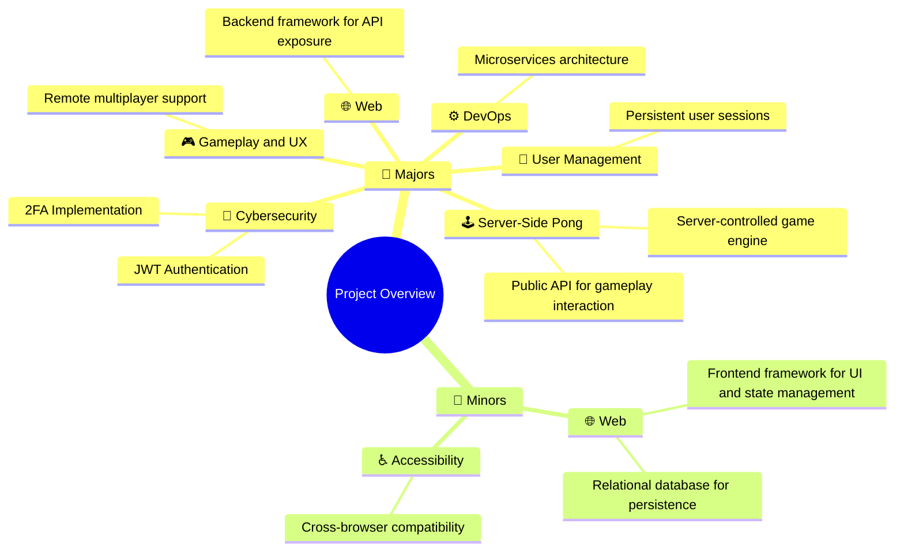

<h1 align="center">ft_Transcendence</h1>
<p align="center"> 
  
</p>

<p align="center"> 
  <a href="https://github.com/pin3dev/42_Cursus/tree/main/library/#06-ft_transcendence">
    
    
    
    
    
    
    
    
    
    
     
     
     
     
  </a>
</p>

<h3>
  <p align="center"> 
    <a href="#introduction">Introduction</a> • 
    <a href="#structure">Structure</a> • 
    <a href="#docs">Docs</a> • 
    <a href="#cloning">Cloning</a> • 
    <a href="#usage">Usage</a> • 
    <a href="#norms">Norms</a> • 
    <a href="#theoretical">Theoretical</a>   
  </p>
</h3>

## 🗣️ Introduction <a id="introduction"></a>

**ft_Transcendence** is a project where the main goal is to build a full-stack web application that allows users to play Pong in real time. In addition to the core functionality, the team is free to define which features the application will offer, as long as it includes at least seven major modules.

The objective of this project is to deepen the understanding of modern web development, including RESTful and WebSocket communication, secure user input handling, client-server architecture, and containerized deployment using Docker.

## 🧬 Project Structure <a id="structure"></a>

This project consists of three main parts: the `frontend`, the `backend`, and the `database`, all containerized and orchestrated via `Docker`.

* **Backend**: The backend is implemented using Fastify as the server (a Node.js framework) and follows a microservices architecture. It is responsible for handling authentication, user management, game logic, real-time communication (via WebSocket), and database interactions. It exposes a RESTful API and a WebSocket gateway to serve the frontend.

* **Frontend**: The frontend is a single-page application (SPA) built with Vue.js. It consumes the API exposed by the backend and manages the user interface for login, profiles, matchmaking, and gameplay.

* **Database**: Each microservice uses its own dedicated SQLite database to store domain-specific data such as user information, match history, and other persistent records. Migrations and schema management are handled through an ORM (Prisma).

All services are containerized using Docker and orchestrated with Docker Compose. A Makefile is provided to automate common development tasks such as building images, running containers, and seeding the database.

## 🗃️ Documentation <a id="docs"></a>

For a detailed breakdown of how the project works, please visit the documentation link below:

<p align="center"> 
  <a href="https://github.com/pin3dev/42_ft-Transcendence/wiki">
    
  </a>
</p>

## 🫥 Cloning the Repository <a id="cloning"></a>

To clone this repository and compile the project, run the following commands:

```bash
git clone https://github.com/pin3dev/42_ft-Transcendence.git
cd 42_ft-Transcendence/ft_transcendence
```
This will download the project to your local machine. Once inside the `ft_transcendence` directory, you can run the provided `Makefile` to build and launch the project.

> [!WARNING]
> Due to macOS security restrictions, do not clone this repository into `~/Downloads` or `~/Desktop`.  
> Use a directory like `~/Documents` or `~/Projects` to ensure Docker can access the files properly.

## 🕹️ Compilation and Usage <a id="usage"></a>

### Makefile

The project comes with a `Makefile` to automate the compilation process. The Makefile includes the following rules:

- `all`: Compiles the server and client programs.
- `clean`: Removes object files.
- `fclean`: Removes object files and the executables.
- `re`: Recompiles the entire project.

- `all`: Generates environment keys, builds the static frontend, builds all Docker images, and starts the application.  
- `keys`: Generates the .env file if it doesn't exist.
- `static-frontend`: Builds the frontend statically using a temporary builder container.
- `build`: Builds all Docker images.
- `run`: Starts the containers in detached mode.
- `stop`: Stops all running containers.
- `iclean`: Stops containers and removes images.
- `vclean`: Same as iclean, but also removes volumes.
- `fclean`: Cleans up everything including Docker system cache.
- `re`: Runs a full clean and rebuild from scratch.
- `exec <service>`: Opens an interactive shell inside the specified container.
- `status <service>`: Shows logs for the specified container.
- `dls`, `vls`, `ils`, `nls`: Inspect Docker containers, volumes, images, and networks.

To compile the project, run:
```bash
make
```
> ⚠️ Note: On macOS, make sure Docker Desktop is running before executing make, as the build depends on the Docker daemon being active.

### Basic Usage

The terminal will display the Docker build and startup logs.  
Once complete, all services will be up and running in the background.

1. Open the application in Google Chrome by navigate to `https://localhost`. This will open the website locally.

2. Feel free to register an account and navigate through the application’s features, including profile and Pong matches.

> [!TIP]
> To play against another player, you’ll need to use a second computer connected to the same local network, such as another 42 school machine within the same cluster.

### Playing with Another Player
To enable secure HTTPS access from another device on the same local network, follow the steps below:

🔹 On the host machine (the one running the server):
1. After running make, locate the file named `transcendence.pem` in the root of the project directory. 
2. Share the `transcendence.pem` file with all users who will access the app from a different machine.
3. Run the following command to get the host machine's local IP address:
```bash
make ip
```
4. Copy the IP address shown after, and save this IP — it will be used later by secondary machines to access the site.
```bash
🌐 LOCAL_IP = <IP>
```

🔹 On each secondary machine (client):
1. Open Google Chrome and navigate to `Settings > Privacy and security > Security > Manage certificates`
2. Switch to the `Authorities` tab, click `Import...`, and select the `transcendence.pem`file received from the host.
3. In the dialog that appears, check the option `Trust this certificate for identifying websites` Then confirm and complete the import.
4. Open Google Chrome and go to:
```bash
https://<host-ip>
```
5. Replace `<host-ip>` with the IP address you saved.

Once the certificate is trusted and the correct IP is used, the secondary device will be able to access the application securely, and both players can use the platform simultaneously to play together.

## ⚠️ Norms and Guidelines Disclaimer <a id="norms"></a>

In this project, the following modules were implemented with the aim of adhering to the specifications defined in the subject document:




## 📖 Theoretical Background <a id="theoretical"></a>

All the theoretical material used to study and carry out this project is organized in the tags described at the beginning of this README.
In addition, these materials can be accessed directly via the link provided below.  

<p align="center"> 
  <a href="https://github.com/pin3dev/42_Cursus/tree/main/library/#06-ft_transcendence">
    
  </a>
</p>


### 👥 Team & Contributions

**@pin3dev**

* Co-designed and implemented the **api-gateway** (with @clima-fr)
* Defined schemas to the **microservices architecture**
* Orchestrated containers with **Docker Compose**
* Automated service workflows via **Makefile**
* Configured **HTTPS security** across all services
* Co-developed the **auth-service** (with @clima-fr)
* Developed the **user-mgmt** 
* Implemented the **tournament-service**
* Built the internal **event-bus** for service communication
* Developed the shared **pckg** module
* Created the **environment generation script** (`env_generator.sh`)
* Integrated **frontend–backend communication for user presence** (with @phrxn)
* Wrote the **GitHub Actions CI workflow**

**@clima-fr**

* Designed and implemented the **api-gateway**
* Developed the **auth-service**
* Co-developed the **user-mgmt** (with @pin3dev)
* Implemented **CORS and JWT validation** across all services
* Integrated the **frontend design** with backend APIs
* Redesigned and refactored multiple **frontend pages** for better UX

**@IsabelaGenial** & **@jaqezita**

* Co-designed the **home page**, **forms**, and parts of the **user profile page**
* Collaborated(with @phrxn) to integrate the **frontend with the game API**

**@phrxn**

* Developed the **server-side game API**, enabling real-time communication via **WebSocket**
* Integrated the game logic with the frontend interface
* Implemented support for **tournament matches with up to 16 players**
* Developed a **user presence service** using WebSocket for tracking online/offline users
